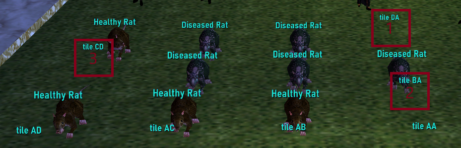
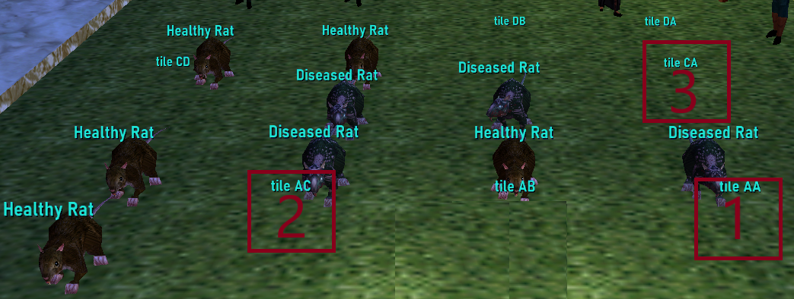
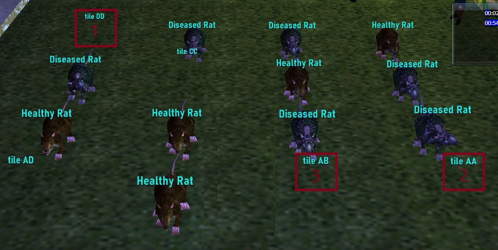

# Qeynos Badge Quests

## [Source: Qeynos Badge Quests]https://wiki.project1999.com/Qeynos_Badge_Quests
## 用群狼術(share wolf form)可 MQ 邪惡種族職業。

---
## 熱鍵

Line 1:
```
/hot BADGE /pause 5,/say Hand me a Confession Document
```
Line 2:
```
/pause 5,/say Take us to the location
```
Line 3:
```
/pause 5,/say I am ready to complete the mission
```
---
## 任務步驟

### Badge 1
 - [ ] 到 South Qeynos 找 an investigator 說 Hand me a Confession Document 得 Confession Document。
 - [ ] 到 Fireprides Shop 裡面把 Confession Document 給 Riley 得 Riley's Confession。
 - [ ] 對 an investigator 說 Hand me a Confession Document 得 Confession Document。
 - [ ] 到 PVP Arena 地下，把 Confession Document 給 Willie Garrote 得 Willie's Confession。
 - [ ] 對 an investigator 說 Hand me a Confession Document 得 Confession Document。
 - [ ] 到碼頭把 Confession Document 給 Donally Stultz，殺他撿 Head of Donally Stultz。
 - [ ] 先對 an investigator 說 Hand me a Confession Document 得 Confession Document。(下個任務用)
 - [ ] 把 Riley's Confession, Willie's Confession 與 Head of Donally Stultz 給 an investigator 得 Investigator's Badge。(an investigator 會消失)

### Badge 2
 - [ ] 到 North Qeynos 大門二樓找 Vegalys Keldrane 給 Investigator's Badge 得 Interrogator's Briefing。
 - [ ] 到 South Karana (地圖左邊中間)找到 an interrogator 給 Interrogator's Briefing。
 - [ ] 護送 interrogator 到隱士(Hermit)的房子。(可以先去等)
 - [ ] "Interrogate"(審問) Theodore Exanthem。(劇情)
 - [ ] 等到 interrogator 說出 "Why don't you hit him for a while. Maybe you will be more convincing then I have been. (Theodore Exanthem gulps nervously.) 用拳頭打 Theodore 一下。
 - [ ] 把 Confession Document 給 Theodore 得 Theodore's Confession。
 - [ ] 對 Theodore 說 "Take us to the location"。
 - [ ] 護送 interrogator 與 Theodore 到廢棄的德魯伊環。(可以先去等，先殺那隻山丘上的狗頭人)
 - [ ] 殺 Morley Murrain 與 Markus Cachexia 撿頭。(他們會招一些骨頭與幽靈，準備 PBAoE)
 - [ ] 把頭與 Theodore's Confession 給 Interrogator 得 Interrogator's Badge。
#### NOTE: Wiki 說可以在 Theodore 停止說話時攻擊跳過整個審問過程。

### Badge 3
 - [ ] 到 North Qeynos 的 Temple of Life 池塘旁(地圖最右邊)把 Interrogator's Badge 給 Velarte Selire (NOT Vegalys) 得 Research Briefing。(這本書說明如何治療老鼠)
 - [ ] 到 West Karana 殺 Oobnopterbevny Biddilets(女地精死靈法師) 撿 Enchanted Jars。(三個瓶子，這段可以先做)
 - [ ] 把 Researcher Briefing 給 Velarte Selire 啟動治療老鼠任務。(限時遊戲6小時=真實18分)
 - [ ] 依序把一到三號瓶子放到空的 tile 來治療老鼠。
 - [ ] 正確治療所有老鼠後，將三個空瓶子給 Velarte 得 Researcher's Badge。

### Badge 4
 - [ ] 到 North Qeynos 大門二樓找 Vegalys Keldrane 給 Researcher's Badge 得 Seal of Vegalys。
 - [ ] 到 Qeynos Sewers(下水道) 找 an investigator(倒在地上) 給 Seal of Vegalys。(會還你)
 - [ ] 走到靠近邪惡職業聚集地前找 Guard Helminth 給 Seal of Vegalys。(會還你)
 - [ ] 對 Guard Helminth 說 "I am ready to complete the mission"。
 - [ ] Guard Helminth 變 Corrupt Guard Helminth 殺死他。(to spawn Azibelle Spavin)
 - [ ] 找 Azibelle Spavin 殺了她撿 Head of Azibelle。
 - [ ] 把 Azibelle's Head 與 Seal of Vegalys 給 Vegalys Keldrane 得 Qeynos Badge of Honor。
#### NOTE: 如果你在這步驟的任何地方失敗了，只要你還有 Seal of Vegalys 就可以無限重啟任務。

---
## Badge 3 任務 Research Briefing 內容 (OCR)

Research Briefing

*** Confidential ***

This aura is a curious thing indeed. When the aura is released, it disperses outward in four directions spreading to each rat it encounters. The aura is weak. Its range is but a few feet.

Note that the aura can not care a diseased rat unless it first encounters one that is healthy. We are unable to account for this sympathetic effect.

When the aura encounters a healthy rat it ricochets back in the other direction, curing each diseased rat between the originator of the aura and the healthy rat the aura encountered. The aura then disperses.

The object of this test is to place the Enchanted Rats in such a way as to eliminate the disease from all rats involved in the test. Do this by taking a jar that contains a Live Enchanted Rat and putting it directly into a Tile.

For safety reasons, the test must he completed within 6 standard Norrathian hours.

The diagrams illustrate the aura's magic flow. Give this briefing to Velarte to begin the test.

Key:

0 = Healthy Rat
X = Diseased Rat

Diagram 1

```
0XX
```

An Enchanted Rat is placed on the far right tile. The aura spreads and heals the two diseased rats.

Result:

```
0000
```

In diagram 1, if an Enchanted Rat is placed on the Tile below a diseased rat, there is no effect. The aura did not encounter a healthy rat and did not reverse its flow.

Result

```
0XX
0
```

Diagram 2

```
0X
   X
   0
```

An Enchanted Rat is placed on the top right Tile. Diseased rats to the left and bottom are cured.

Result

```
000
   0
   0
```

Diagram 3

```
0XX
 XXX
 0 0
```

An Enchanted Rat is placed on the top right Tile results as shown right.

Result_

```
0000
 XX0
 X 0
```

An Enchanted Rat is placed on the left Tile second from the top. Results below.

```
0000
0000
 X 0
```

Return all three Empty Ehchanted Jars to Velarte when finished. Do not drop any empty jar on a tile. It will break.

---
## Research Badge 任務參考截圖
### 例一

### 例二

### 例三


---