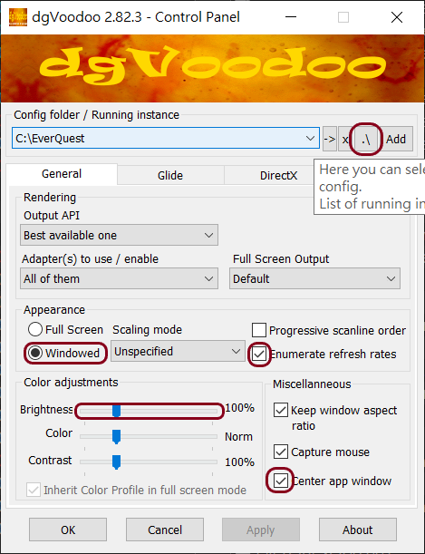
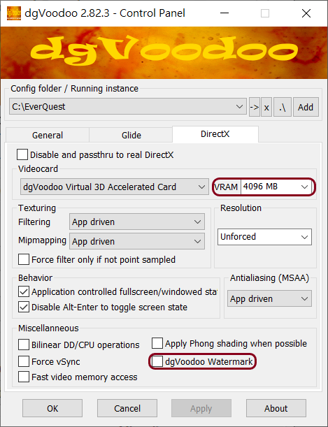

## 常用連結：
- [查價 (取代以前的 unixgeek)](https://pigparse.azurewebsites.net/ServerIndex/Green)
- [Scout Time](https://pigparse.azurewebsites.net/)
- [P99 Wiki](https://wiki.project1999.com)
- [顯卡設定指南](https://everquest.fanra.info/wiki/Graphics_and_performance_settings_guide#Necessary_effects)
- [任務 Qeynos Badge Quests](https://wiki.project1999.com/Qeynos_Badge_Quests)
- [Purple Links When Pulling](https://wiki.project1999.com/Meviin%27s_Macros:_Purple_Links_When_Pulling)
- [Monk EPIC 1.0](https://www.eqprogression.com/monk-1-0-epic-quest/)
- [Druid EPIC 1.0](https://www.eqprogression.com/druid-1-0-epic-quest/)
- [Necro EPIC 1.0](https://www.eqprogression.com/necromancer-1-0-epic-quest/)
- [Mage EPIC 1.0](https://www.eqprogression.com/magician-1-0-epic-quest/)
- [Cleric EPIC 1.0+](https://everquest.allakhazam.com/db/quest.html?quest=757) 多了組合珍珠的版本 (EQTHJ)
- [EQTHJ](https://heroesjourneyemu.com/)
- [THJ-Wiki](https://thj-wiki.web.app/)
---

## 好用工具：
- [PigParser(EqTool)](https://github.com/smasherprog/EqTool) 好用地圖與計時器
- [OldCatchUp](https://github.com/smasherprog/EqTool/releases/tag/OldCatchUp) EqTool 最新版本 download
- [GINA](https://eq.gimasoft.com/gina/) 自訂計時器
- [Boarderless-Gaming-9.5.6](https://github.com/Codeusa/Borderless-Gaming/releases/tag/9.5.6) 無邊框視窗全螢幕模式(適用筆電小螢幕)
- [p99-login-middlemand](https://github.com/rm-you/p99-login-middlemand/releases/tag/win-rel1) 修復登入問題的軟體 (已整合至 PigParser/EQTool )
- [DgVoodoo2](http://dege.freeweb.hu/dgVoodoo2/) 修復 nVidia 顯卡遇到火焰時螢幕會凍結的問題
- [WinEQ2](https://www.lavishsoft.com/download/wineq2) 修正顯示頻率過快 (EQPlayNice)
- [S3DSpy_1.2.zip](https://sourceforge.net/projects/eqemulator/files/OpenZone/S3DSpy%201.2/S3DSpy_1.2.zip/download) 修改音效

---
## 音效修改檔(已用S3DSpy修改完畢)：
- 解壓縮後放入 EQ 目錄覆蓋原檔案即可。
- [無雷聲](SoundFix/snd2fix(nothunders).zip)
- [死靈59寵物無聲](SoundFix/snd5fix(no_spectre_loop_idle).zip)
- [Lavastorm無炎爆聲](SoundFix/snd11fix(lavastorm).zip)
- [POM無笑聲](SoundFix/snd8fix(pom_laughing).zip)

## 音效修改 (THJ)
到 `EQTHJ\extra\sound_mute\` 執行如
`idle_mobs_mute.bat` 與 `weather_mute.bat` 等檔案即可。

---
## 常用指令：
```
; 位址查詢
/loc

; 使用技能，通常設 sense heading，等級一時先花一點去導師那學習
/doability 1~6

; 使用戰鬥技能
/doability 7~10

; change font size
/chatfontsize 1~6

; check your bind point
/charinfo

; assist 時自動攻擊關閉
/assist off

; 常用熱鍵
/hot LOC /loc
/hot ASS /assist
/hot ASS2 /assist <name>

# 隱藏已經 loot 過的怪物
/hot LOOTED /hidecorpse looted
# 取消隱藏已經 loot 過的怪物
/hot NONE /hidecorpse none

; 寵物熱鍵
/hot PetAtk /pet attack
/hot PetBak /pet back off
/hot PetFlw /pet follow me
/hot PetGrd /pet guard here
/hot PetSit /pet Sit
```

## 常用 Macro:
```
# Bard Song
# 單首歌 Song1
/pause 2,/stopsong
/pause 2,/cast 1

## 兩首歌 (中間可穿插使用 Breath of Harmony)
/pause 1,/stopsong
/pause 28,/cast 4
/pause 1,/stopsong
/cast 2

# Feign Death
# (在 attack 狀態直接 FD 會有 bug，怪依然會繼續攻擊)
/attack off
/doability 4

# Auto Attack
# disarm, kick 可以放一起
/attack on
/doability 10
/doability 7
```

---
## 輸出檔案：
```
; 裝備與銀行
/outputfile inventory charactername_inventory.txt

; 法術書
/outputfile spellbook charactername_spellbook.txt
```

---
## Target Purple link 紫色連結
- [Purple Links When Pulling](https://wiki.project1999.com/Meviin%27s_Macros:_Purple_Links_When_Pulling)
- [Item ID](https://mqemulator.net/item.php?id=16594)

Example:
```
Page2Button12Name=Incoming
Page2Button12Color=17
Page2Button12Line1=/g Incoming <0032F7000000000000000000000000000000000000000      %t >.  One per message.
```

---
## DgVoodoo2 修復 nVidia 顯卡遇到火焰時螢幕會凍結的問題
- fix nVidia card in game flame cause screen frozen issue.
- [DgVoodoo2](http://dege.freeweb.hu/dgVoodoo2/)
- [DgVoodoo2_Download](http://dege.freeweb.hu/dgVoodoo2/dgVoodoo2/)

## How-To Use dgVoodoo2
1. copy files
    - copy dgVoodooCpl.exe C:\EverQuest
    - copy MS\x86\*.* C:\EverQuest
2. launch dgVoodooCpl.exe
3. config
    - click the ".\" button on the right of the location bar
    - on General tab
        - check Windowed
        - check Enumerate refresh rates
        - adjust Brightness
        - check Center App Window
    - on DirectX tab
        - select appropriate VRAM (GPUZ to find out)
        - check off dgVoodoo Watermark (check on to make sure DgVoodoo working)
4. Click Apply or OK, Restart EQ, dgVoodoo2 will be loaded automatically.

## 使用說明
1. 拷貝檔案
    - 拷貝 dgVoodooCpl.exe 到 C:\EverQuest (我的 EQ P99 目錄，自己改)
    - 拷貝 MS\x86 裡的所有 DLL 檔到 C:\EverQuest
2. 執行 dgVoodooCpl.exe
3. 設定
    - 在位址條的右邊，點擊 ".\" 按鈕讓 dbVoodoo 定位到你的 EQ 目錄。
    - 3.1 到 General 標籤
        - 選 Windowed (應該沒人用 Full Screen 玩吧?)
        - 點選 Enumerate refresh rates (模擬 Voodoo 卡的更新頻率)
        - 調整亮度 Brightness (不調整也可以)
        - 點選 Center App Window (讓你的 EQ 視窗啟動時保持在螢幕正中間)
    - 3.2 到 DirectX 標籤
        - 選擇正確的 VRAM (GPUZ to find out) (不知道隨便選 1~2G 都可以)
        - 取消點選 dgVoodoo Watermark (也可以先不點掉，用來測試 DgVoodoo 是否有在運作，確定後再回來點掉)
4. 最後按下 OK，關閉 dgVoodoo2，重新啟動 EQ 就會自動載入 dgVoodoo2，以後就不用動。





---
## GINA
- [https://eq.gimasoft.com/gina/](https://eq.gimasoft.com/gina/)
- [Download](https://eq.gimasoft.com/gina/Download.aspx)

- {C} = character name
- ${1}, ${name} = back reference
- ${S}, ${S1} ... ${Sn} = wildcards = (?<s#>.+)
- ${N} = number
- {L} = matched text
- {COUNTER} = counter
- {TS} = timer

### ### Supported {} tags
[https://eq.gimasoft.com/forums/viewtopic.php?f=7&t=23](https://eq.gimasoft.com/forums/viewtopic.php?f=7&t=23)

```
GINA supports the following tags in triggers:

{C} - This is replaced with the character's name, and can be used in Search Text, Display Text, Text to Say, and Timer Name fields.

{S} - This is a wildcard that can match any string. This can be used in Search Text, Display Text, Text to Say, and Timer Name fields.

{S1}, {S2}, etc -- Work the same as {S}, just gives you more wildcards.

{N} - This is a wildcard that matches a number. If you only want the trigger to match if the number meets a certain critera, you can use syntax such as {N>=50000} and the tag will only match if the number is greater than 50k. This can be used in Search Text, Display Text, Text to Say, and Timer Name fields. (The >=50000 portion should only be used in the Search Text field. Just use {N} in the rest of the fields.)

{N1}, {N2}, etc. -- Work the same as {N}, just gives you more wildcards.

{L} -- This is replaced with the whole line of text when a trigger is matched. This can be used in Display Text, Text to Say, and Timer Name fields, but not in the Search Text field.

{COUNTER} - Resolves to the number of times a trigger has been matched (tracked per character). This can be used in Display Text, Text to Say, and Timer Name fields.

{TS} - This matches a time span and is used to set a timer duration dynamically. This tag can only be used in the Search Text field. If this tag is present in the Search Text field and the trigger's Timer Type is set to Timer or Repeating Timer, this result of this match will be used as the Timer Duration when the trigger is matched. The tag will match the format D:H:M:S.L where D = days, H = hours, M = minutes, S = seconds, and L = fraction of second, and only the S (seconds) value is required. Examples of supported matches are:

- 90 (start 90 second timer)
- 20.5 (start 20 second 500 millisecond timer)
- 5:30 (start timer 5 minute 30 second timer)
- 1:00:00 (start 1 hour timer)
- 2:12:15:20 (start 2 day 12 hour 15 minute 20 second timer -- note: log off, take a break from the game!)
```

```
The {S} and {S#} are just shortcuts for the regex (?<s#>.+) in Regex.
```

### Fast Check
- [https://eq.gimasoft.com/forums/viewtopic.php?f=7&t=185](https://eq.gimasoft.com/forums/viewtopic.php?f=7&t=185)

- Fast Check 會先找到字串再使用正規表示式，會忽略 `()` 包起來的字串，所以像是 `(xxx|ooo)` 這種表示式等於無效。
- 這功能大概是早期電腦效能不好時的解決方案，現在沒太大好處反而有時候會有問題，建議不要勾。

---
