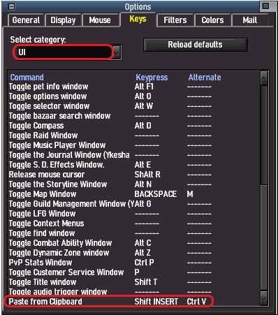
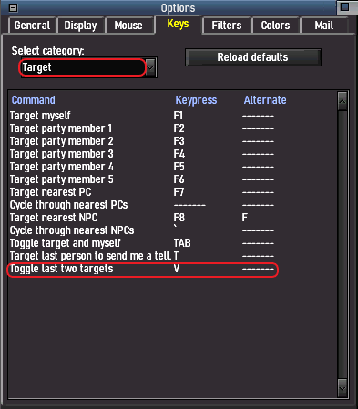
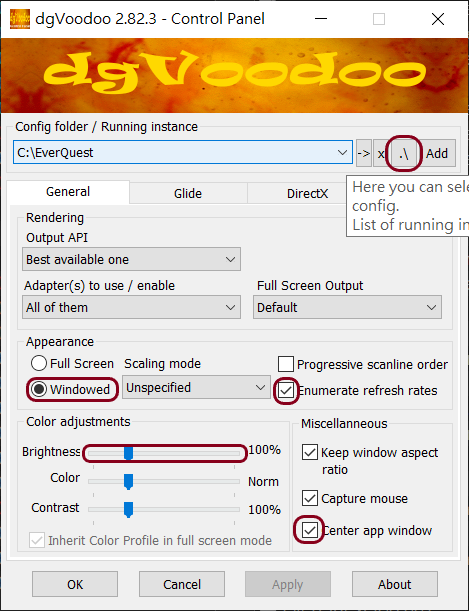
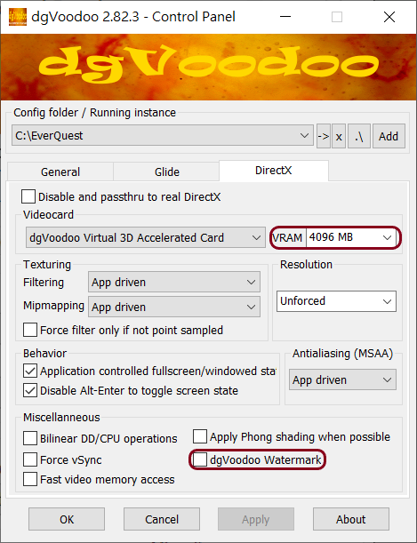

---
## 索引 (Table of Contents)
- [索引 (Table of Contents)](#索引-table-of-contents)
- [常用連結](#常用連結)
- [任務](#任務)
- [好用工具](#好用工具)
- [音效修改檔 (已用S3DSpy修改完畢)](#音效修改檔-已用s3dspy修改完畢)
- [設定常用按鍵](#設定常用按鍵)
  - [設定貼上鍵為 ctrl+v 與 shift+insert](#設定貼上鍵為-ctrlv-與-shiftinsert)
  - [設定最後兩個目標切換鍵](#設定最後兩個目標切換鍵)
- [常用 Macro](#常用-macro)
  - [創建位址查詢熱鍵](#創建位址查詢熱鍵)
  - [關閉滑鼠右鍵看裝備 (mouse inspect off)](#關閉滑鼠右鍵看裝備-mouse-inspect-off)
  - [關閉 loot 自動分錢 (loot moeny split off)](#關閉-loot-自動分錢-loot-moeny-split-off)
  - [assist 關閉自動攻擊](#assist-關閉自動攻擊)
  - [使用某個 Discipline (alt+c)](#使用某個-discipline-altc)
  - [使用技能 (ctrl+a)](#使用技能-ctrla)
  - [使用戰鬥技能 (ctrl+c)](#使用戰鬥技能-ctrlc)
  - [修改字型大小 (change font size)](#修改字型大小-change-font-size)
  - [查 bind 點 (check your bind point)](#查-bind-點-check-your-bind-point)
  - [創建 assist 熱鍵](#創建-assist-熱鍵)
  - [創建隱藏已經 loot 過的怪物熱鍵](#創建隱藏已經-loot-過的怪物熱鍵)
  - [取消隱藏已經 loot 過的怪物](#取消隱藏已經-loot-過的怪物)
  - [創建寵物熱鍵](#創建寵物熱鍵)
  - [Bard 單首歌 Song1](#bard-單首歌-song1)
  - [Bard 兩首歌 (中間可穿插使用 Breath of Harmony)](#bard-兩首歌-中間可穿插使用-breath-of-harmony)
  - [Feign Death](#feign-death)
  - [單鍵 Auto Attack 技能](#單鍵-auto-attack-技能)
  - [Hide 確認](#hide-確認)
  - [Forage 自動收納](#forage-自動收納)
  - [Rouge Evade](#rouge-evade)
- [輸出檔案指令](#輸出檔案指令)
  - [某角色裝備與銀行](#某角色裝備與銀行)
  - [某角色法術書](#某角色法術書)
- [螢幕比例設定：](#螢幕比例設定)
- [紫色連結 (Target Purple link)](#紫色連結-target-purple-link)
- [DgVoodoo2 修復 nVidia 顯卡遇到火焰螢幕凍結的問題](#dgvoodoo2-修復-nvidia-顯卡遇到火焰螢幕凍結的問題)
  - [How-To Use dgVoodoo2](#how-to-use-dgvoodoo2)
  - [dgVoodoo2 使用說明](#dgvoodoo2-使用說明)
- [GINA Notes](#gina-notes)
  - [Supported {} tags](#supported--tags)
  - [Fast Check](#fast-check)

---
## 常用連結
- [查價 (取代以前的 unixgeek)](https://pigparse.azurewebsites.net/ServerIndex/Green)
- [Scout Time](https://pigparse.azurewebsites.net/)
- [Project 1999 Wiki](https://wiki.project1999.com) | [P99 Wiki Mirror](https://p99wiki.eqgeeks.org/Main_Page) | [P99 Wiki Archive](https://web.archive.org/web/20260101184950/https://wiki.project1999.com/)
- [EQ Progression](https://www.eqprogression.com/)
- [EQ Atlas 地圖](https://eqatlas.ca/)
- [顯卡設定指南](https://everquest.fanra.info/wiki/Graphics_and_performance_settings_guide#Necessary_effects)
- [Spell Research Note](spell_research.md)

---
## 任務
- ~~[2025 聖誕節特別任務(已結束)](XMAS-2025.md)~~
- [奇諾斯榮譽徽章](Qeynos_Badge.md) | [Qeynos Badge Quests](https://wiki.project1999.com/Qeynos_Badge_Quests)
- [The Grammar Manual(Ice Forged Shackles)](https://wiki.project1999.com/The_Grammar_Manual)
- [Reinforcements for The Tunarean Regiment](https://wiki.project1999.com/Reinforcements_for_The_Tunarean_Regiment)
- [Ralgyn's Promise](https://wiki.project1999.com/Ralgyn%27s_Promise)
- [Monk EPIC 1.0](https://www.eqprogression.com/monk-1-0-epic-quest/)
- [Druid EPIC 1.0](https://www.eqprogression.com/druid-1-0-epic-quest/)
- [Necromancer EPIC 1.0](https://www.eqprogression.com/necromancer-1-0-epic-quest/)
- [Magician EPIC 1.0](https://www.eqprogression.com/magician-1-0-epic-quest/)
- [Enchanter EPIC 1.0](https://www.eqprogression.com/enchanter-1-0-epic-quest/) [Enc Epic P99](https://wiki.project1999.com/Enchanter_Epic_Quest)

---
## 好用工具
- [PigParser (EqTool)](https://github.com/smasherprog/EqTool) 好用地圖與計時器
- ~~[GINA](https://eq.gimasoft.com/gina/) LogParser/Trigger (server down)~~
- [GINA Guide](https://formerglory.lol/gina/) Gina New Download Link
- ~~[Boarderless-Gaming-9.5.6](https://github.com/Codeusa/Borderless-Gaming/releases/tag/9.5.6) 無邊框視窗全螢幕模式(適用筆電小螢幕)~~
- [Boarderless-Gaming 9.6.0](https://legacy.borderlessgam.ing/BorderlessGaming9.6_admin_setup.exe) 無邊框視窗全螢幕模式(適用筆電小螢幕)
- [p99-login-middlemand](https://github.com/rm-you/p99-login-middlemand/releases/tag/win-rel1) 修復登入問題的軟體 (已整合至 PigParser/EQTool )
- [DgVoodoo2](http://dege.freeweb.hu/dgVoodoo2/) 修復 nVidia 顯卡凍結問題
- [WinEQ2](https://www.lavishsoft.com/download/wineq2) 修正顯示頻率過快 (EQPlayNice)
- [S3DSpy_1.2.zip](https://sourceforge.net/projects/eqemulator/files/OpenZone/S3DSpy%201.2/S3DSpy_1.2.zip/download) 修改音效
- [CCHPM](https://kingdomdkp.com/index.php/Guides/Chain-ch-performance-monitor-tool-cchpm.html) | [CCHPM V1.16.zip](https://kingdomdkp.com/data/files/system/guides/tools/CCHPM/CCHPM%20V1.16.zip) | [CCHPM(github)](https://github.com/winter88888/CCHPM) CH 輔助
- [EQ NAG](https://guildantix.github.io/eq-nag/) LogParser/Trigger (GINA replacement)
- [Krazzee's EQ Mods](https://sites.google.com/view/krazzee-eq/downloads) midi soundfont
- [DXVK](https://github.com/doitsujin/dxvk) A Vulkan-based translation layer for Direct3D 8/9/10/11
- [p99-login-proxy](https://github.com/eq-p99-tools/p99-login-proxy) | [kingdom fork](https://github.com/TheGrandPackard/p99-login-proxy/) 簡化登入工具

---
## 音效修改檔 (已用S3DSpy修改完畢)
- 解壓縮後放入 EQ 目錄覆蓋原檔案即可。
- ~~[snd2 無雷聲](SoundFix/snd2fix(nothunder).zip)~~
- [snd2 無風無雷與盒子音量降低](SoundFix/snd2fix(nothunder_nowind_chestfix).zip)
- [snd5 死靈59寵物無聲](SoundFix/snd5fix(no_spectre_loop_idle).zip)
- [snd8 POM無笑聲](SoundFix/snd8fix(pom_laughing).zip)
- [snd11 Lavastorm無炎爆聲](SoundFix/snd11fix(lavastorm).zip)

---
## 設定常用按鍵

### 設定貼上鍵為 ctrl+v 與 shift+insert
P99 沒有預設貼上鍵，要自己加：
1. 按下 alt+o 打開 options。
2. 按 Keys 分頁，選 UI 往下拉。
3. 把 "Paste form Clipboard" 設為 ctrl+v 與 shift+insert。



### 設定最後兩個目標切換鍵
可以使用這個按鍵將團隊buff施放給lv45以下的玩家，我習慣設為v。
- alt+o -> Keys -> Target -> "Toggle last two targets"。



---
## 常用 Macro
### 創建位址查詢熱鍵
```
/hot LOC /loc
```

### 關閉滑鼠右鍵看裝備 (mouse inspect off)
```
/toggleInspect off
```

### 關閉 loot 自動分錢 (loot moeny split off)
```
/autosplit off
```

### assist 關閉自動攻擊
```
/assist off
```

### 使用某個 Discipline (alt+c)
(只輸入 /disc 可查時間)
```
/disc StoneStance
```

### 使用技能 (ctrl+a)
- /do 1~6
- Sense Heading 一定要先花一點去導師那學習才會提升
```
/doability 1
```

### 使用戰鬥技能 (ctrl+c)
- /do 7~10
```
/doability 7
```

### 修改字型大小 (change font size)
- 1~6
```
/chatfontsize 6
```

### 查 bind 點 (check your bind point)
```
/charinfo
```

### 創建 assist 熱鍵
```
/hot ASS /assist
```

### 創建隱藏已經 loot 過的怪物熱鍵
```
/hot LOOTED /hidecorpse looted
```

### 取消隱藏已經 loot 過的怪物
```
/hot NONE /hidecorpse none
```

### 創建寵物熱鍵
```
/hot PetAtk /pet attack
```
```
/hot PetBak /pet back off
```
```
/hot PetFlw /pet follow me
```
```
/hot PetGrd /pet guard here
```
```
/hot PetSit /pet sit
```

### Bard 單首歌 Song1
- 加 `/pause` 會導致切換歌曲時施法條消失。
```
/stopsong
/cast 1
```

### Bard 兩首歌 (中間可穿插使用 Breath of Harmony)
- `/pause 28,/cast 4` 會先 `/cast 4` 再 `/pause 28`。
```
/pause 1,/stopsong
/pause 28,/cast 4
/pause 1,/stopsong
/cast 2
```

### Feign Death
- attack 狀態直接 FD 有 bug，怪依然會繼續攻擊。
```
/attack off
/do 4
```

### 單鍵 Auto Attack 技能
- disarm, kick 可以放一起。
```
/attack on
/do 10
/do 7
```

### Hide 確認
- 不可以有看見隱形的能力 (buff or item)
```
/pause 2,/do 3
/pause 0,/target NAME
```

### Forage 自動收納
```
/pause 0,/stand
/pause 5,/do 6
/pause 0,/autoinv
```

### Rouge Evade
- EQ Rogue Evade = 戰鬥中 Hide，成功會有訊息: You have momentarily ducked away from the main combat.
```
/pause 0,/attack off
/pause 2,/do 3
/pause 0,/attack on
```

---
## 輸出檔案指令

### 某角色裝備與銀行
```
/outputfile inventory NAME_inventory.txt
```

### 某角色法術書
```
/outputfile spellbook NAME_spellbook.txt
```

---
## 螢幕比例設定：
- `/viewport {left up right down}`
- https://wiki.project1999.com/Viewport
- 更改螢幕比例不會影響UI與滑鼠座標。

768p 4:3
```
/viewport 171 0 1024 768
```

768p 16:9
```
/viewport 0 0 1366 768
```

1080p 4:3
```
/viewport 240 0 1440 1080
```

1080p 16:9
```
/viewport 0 0 1920 1080
```

1440p 4:3 (2K):
```
/viewport 320 0 1920 1440
```

1440p 16:9 (2K):
```
/viewport 0 0 2560 1440
```

---
## 紫色連結 (Target Purple link)
- [Purple Links When Pulling](https://wiki.project1999.com/Meviin%27s_Macros:_Purple_Links_When_Pulling)
- [Item ID](https://mqemulator.net/item.php?id=16594)
- [進制轉換](https://www.binaryhexconverter.com/decimal-to-hex-converter)

修改步驟：
1. 安裝一個純文字編輯器([Notepad++](https://notepad-plus-plus.org/), [Sublime](https://www.sublimetext.com/), [VS Code](https://code.visualstudio.com/download), [Neovim](https://neovim.io/))。
2. 進入 EQ，隨便創一個 macro，如 "`/hot Incoming /g Incoming %t`"。
3. 退出 EQ，進入 EQ 目錄，找到 "`角色名稱_project1999.ini`" 檔案，用純文字編輯器打開。
4. 到上面 [Item ID](https://mqemulator.net/item.php?id=16594) 連結尋找你想顯示的物品。
5. 到上面 [進制轉換](https://www.binaryhexconverter.com/decimal-to-hex-converter)
 連結把 ID 從10進制轉為16進制。
6. 把原本的 Inc Macro 改成新的 Macro 如下。
```
Page2Button12Name=Incoming
Page2Button12Color=17
Page2Button12Line1=/g Incoming <0032F7000000000000000000000000000000000000000      %t >.  One per message.
```
7. 注意物品 ID 前後有特殊的不可見字元，如果不知道怎樣正確複製，可下載 [purple-link.txt](https://raw.githubusercontent.com/City-Angel/EQ-Notes/refs/heads/main/purple-links.txt) 把有特殊字元那段複製貼上。
8. 關閉純文字編輯器，啟動 EQ 測試。

---
## DgVoodoo2 修復 nVidia 顯卡遇到火焰螢幕凍結的問題
- fix nVidia card in game flame cause screen frozen issue.
- [DgVoodoo2](http://dege.freeweb.hu/dgVoodoo2/)
- [DgVoodoo2_Download](http://dege.freeweb.hu/dgVoodoo2/dgVoodoo2/)

### How-To Use dgVoodoo2
1. copy files
    - copy dgVoodooCpl.exe C:\EverQuest
    - copy MS\x86\*.* C:\EverQuest
2. launch dgVoodooCpl.exe
3. config
    - click the ".\" button on the right of the location bar
    - on General tab
        - check Windowed
        - check Enumerate refresh rates
        - adjust Brightness
        - check Center App Window
    - on DirectX tab
        - select appropriate VRAM (GPUZ to find out)
        - check off dgVoodoo Watermark (check on to make sure DgVoodoo working)
4. Click Apply or OK, Restart EQ, dgVoodoo2 will be loaded automatically.

### dgVoodoo2 使用說明
1. 拷貝檔案
    - 拷貝 dgVoodooCpl.exe 到 C:\EverQuest (我的 EQ P99 目錄，自己改)
    - 拷貝 MS\x86 裡的所有 DLL 檔到 C:\EverQuest
2. 執行 dgVoodooCpl.exe
3. 設定
    - 在位址條的右邊，點擊 ".\" 按鈕讓 dbVoodoo 定位到你的 EQ 目錄。
    - 3.1 到 General 標籤
        - 選 Windowed (應該沒人用 Full Screen 玩吧?)
        - 點選 Enumerate refresh rates (模擬 Voodoo 卡的更新頻率)
        - 調整亮度 Brightness (不調整也可以)
        - 點選 Center App Window (讓你的 EQ 視窗啟動時保持在螢幕正中間)
    - 3.2 到 DirectX 標籤
        - 選擇正確的 VRAM (GPUZ to find out) (不知道隨便選 1~2G 都可以)
        - 取消點選 dgVoodoo Watermark (也可以先不點掉，用來測試 DgVoodoo 是否有在運作，確定後再回來點掉)
4. 最後按下 OK，關閉 dgVoodoo2，重新啟動 EQ 就會自動載入 dgVoodoo2，以後就不用動。





---
## GINA Notes
- [https://eq.gimasoft.com/gina/](https://eq.gimasoft.com/gina/)
- [Download](https://eq.gimasoft.com/gina/Download.aspx)

- {C} = character name
- ${1}, ${name} = back reference
- ${S}, ${S1} ... ${Sn} = wildcards = (?<s#>.+)
- ${N} = number
- {L} = matched text
- {COUNTER} = counter
- {TS} = timer

### Supported {} tags
[https://eq.gimasoft.com/forums/viewtopic.php?f=7&t=23](https://eq.gimasoft.com/forums/viewtopic.php?f=7&t=23)

```
GINA supports the following tags in triggers:

{C} - This is replaced with the character's name, and can be used in Search Text, Display Text, Text to Say, and Timer Name fields.

{S} - This is a wildcard that can match any string. This can be used in Search Text, Display Text, Text to Say, and Timer Name fields.

{S1}, {S2}, etc -- Work the same as {S}, just gives you more wildcards.

{N} - This is a wildcard that matches a number. If you only want the trigger to match if the number meets a certain critera, you can use syntax such as {N>=50000} and the tag will only match if the number is greater than 50k. This can be used in Search Text, Display Text, Text to Say, and Timer Name fields. (The >=50000 portion should only be used in the Search Text field. Just use {N} in the rest of the fields.)

{N1}, {N2}, etc. -- Work the same as {N}, just gives you more wildcards.

{L} -- This is replaced with the whole line of text when a trigger is matched. This can be used in Display Text, Text to Say, and Timer Name fields, but not in the Search Text field.

{COUNTER} - Resolves to the number of times a trigger has been matched (tracked per character). This can be used in Display Text, Text to Say, and Timer Name fields.

{TS} - This matches a time span and is used to set a timer duration dynamically. This tag can only be used in the Search Text field. If this tag is present in the Search Text field and the trigger's Timer Type is set to Timer or Repeating Timer, this result of this match will be used as the Timer Duration when the trigger is matched. The tag will match the format D:H:M:S.L where D = days, H = hours, M = minutes, S = seconds, and L = fraction of second, and only the S (seconds) value is required. Examples of supported matches are:

- 90 (start 90 second timer)
- 20.5 (start 20 second 500 millisecond timer)
- 5:30 (start timer 5 minute 30 second timer)
- 1:00:00 (start 1 hour timer)
- 2:12:15:20 (start 2 day 12 hour 15 minute 20 second timer -- note: log off, take a break from the game!)
```

```
The {S} and {S#} are just shortcuts for the regex (?<s#>.+) in Regex.
```

### Fast Check
- [https://eq.gimasoft.com/forums/viewtopic.php?f=7&t=185](https://eq.gimasoft.com/forums/viewtopic.php?f=7&t=185)

- Fast Check 會先找到字串再使用正規表示式，會忽略 `()` 包起來的字串，所以像是 `(xxx|ooo)` 這種表示式等於無效。
- 這功能大概是早期電腦效能不好時的解決方案，現在沒太大好處反而有時候會有問題，建議不要勾。

---
